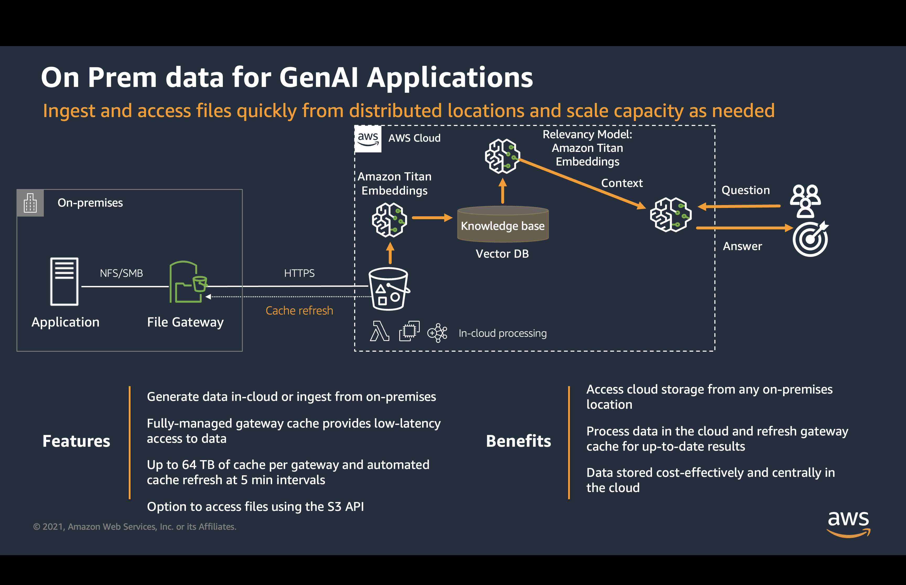
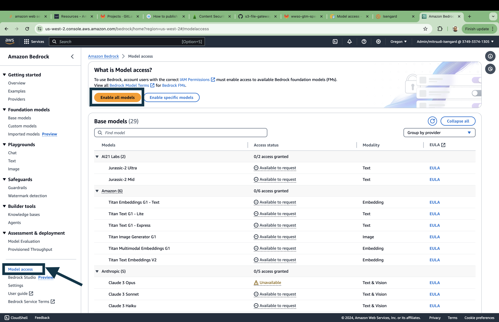
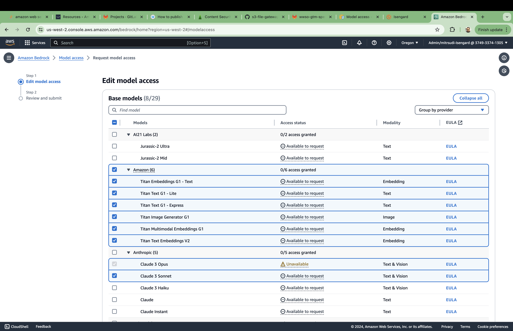
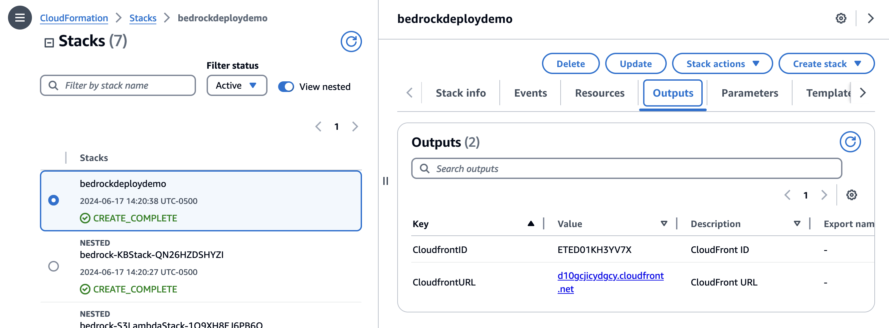
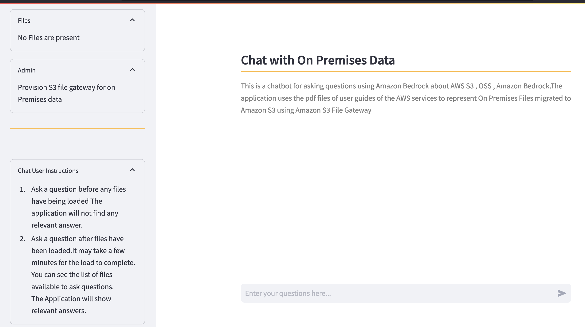

### Solution Overview

This exercise guides users through the process of setting up a demo environment in AWS to simulate the experience of using an Amazon S3 File Gateway to easily copy files from data sources on premises that are stored on file servers or NAS devices into AWS. Amazon Bedrock can then leverage those files for RAG (Retrieval-Augmented Generation) in order to build a Knowledge Base for natural language processing.

### Pre-Requisites
Acess to Base models must be enabled for this soltuion.Go to Bedrock console and enbale access to the Amazon Base Models and Claude 3 Sonnet Models.

Choose the Enable all models Button and then make a choice of models in the next screen as shown below. Press Next , Press Submit.

### Deployment Steps

#### Step1: Clone the GitHub repo and deploy the codepipeline.yaml stack in CloudFormation

Stack Does the following:

  - Creates an S3 bucket to upload on premises data from S3 File Gateway
  - Creates a Lambda function that Watches for .pdf file arrivals under the 'onpremdata' prefix , and starts an ingestion job using KB APIs, which will read data from s3, chunk it, convert chunks into embeddings using Amazon Titan Embeddings model and then store these embeddings in AOSS. All of this without having to build, deploy and manage the data pipeline.
  - Creates an empty OpenSearch serverless index.
  - Creates an  Amazon Bedrock knowledge base.
  - Creates a data source within the knowledge base which connects to Amazon S3 bucket provisioned.
  - Creates an EC2 instance to be used as the host server for the File Gateway in order to simulate deployment on premises on a virtual machine or appliance.
  - Creates a Windows EC2 instance with 3 PDF files to simulate a source server onto which the File Gateway can mount an SMB file share.
    **Note before deploying the stack, please ensure that you have created an EC2 Key Pair for the region where you will be deploying the File Gateway and select the KeyName when deploying the CloudFormation Stack.

#### Step2: Once all nested stacks have deployed, select the output tab of the bedrockdeploydemo stack and click on the Cloudfront URL 

#### Step3: Once the web application is running , follow the steps outlined in the Gateway.md file

## Security

See [CONTRIBUTING](CONTRIBUTING.md#security-issue-notifications) for more information.

## License

This library is licensed under the MIT-0 License. See the LICENSE file.

